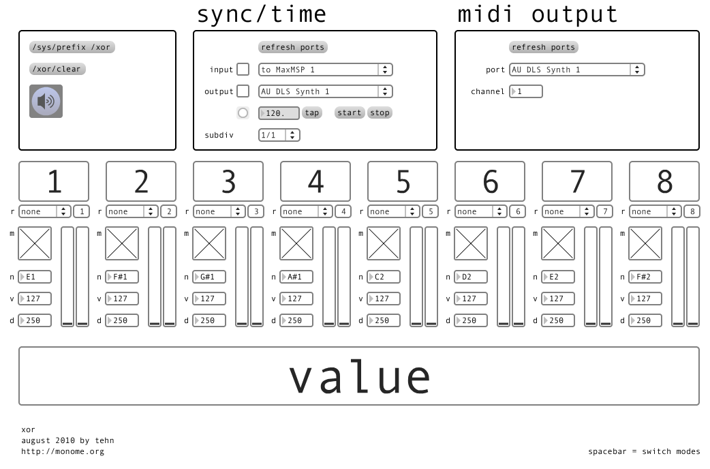

# xor

inspired by axon (by the fine people at http://www.audiodamage.com who deserve your support!)

a mix of muon and flin in some aspects

created by: tehn

http://vimeo.com/14159606

## notes

two monome-controlled modes: "values" and "links"

hit space bar to toggle between modes.

each channel (1-8) has a set value. each channel accumulates triggers from other channels. when a channel's collected triggers is more than the set value, this channel sends out its own trigger, sets a new rule, and plays a note, and resets itself to accept new triggers.

ch 1 is driven by the metronome (sync/time) box. you can midi sync this in/out. the subdivision dropdown sets the note length.

in "values" mode each key touched sets a new value, also resetting the received trigger count.

where a channel trigger is sent is controlled by the "links" matrix. for example, channel 1 could be set to send to channel 3 and 4, while channel 4 sends to channel 2, etc. each channel is a column; its destination triggers are set from top to bottom. a channel cannot trigger itself.

the "rules" dropdown gives several options which can be executed. the number next to the rule is the to-be-changed channel. for example, on channel 1, with a rule of "random 1", upon each reset a random value will be set (see video for an example of this). you can cross-map for interesting effects -- try setting ch 1 to "inc 1" and ch 2 to "min 1," having ch 1 send triggers to ch2.

lastly, midi setup is at the bottom.

* m mute
* n note
* v velocity
* d duration